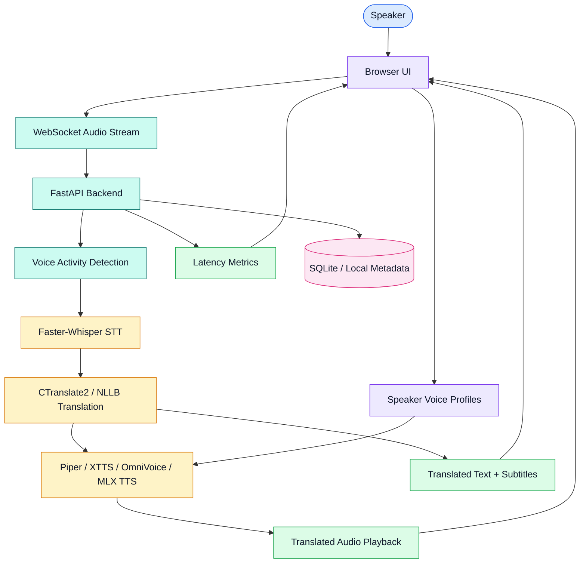

# Real-Time Speech Translation System

[](https://www.python.org/)
[](https://fastapi.tiangolo.com/)
[](https://github.com/SYSTRAN/faster-whisper)
[](https://opennmt.net/CTranslate2/)
[](https://github.com/rhasspy/piper)
[](https://developer.apple.com/metal/)

Real-time speech translation system for online conference scenarios. The project captures live speech, detects speech segments, transcribes them, translates the text, synthesizes translated audio, and displays latency metrics through a browser-based interface.

Bachelor thesis context: real-time / near-real-time speech translation during online conferences.

## Overview

This project implements a modular speech translation pipeline:

```text
Audio input -> VAD -> STT -> MT -> TTS -> translated audio + subtitles
```

The system is designed around open-source models and local execution, with special attention to Apple Silicon performance. It uses FastAPI and WebSockets for the backend streaming layer, a browser UI for interaction and visualization, and swappable model backends for transcription, translation, and speech synthesis.

## Demo

[](https://www.youtube.com/watch?v=_-jwEyGxDYs)

## Features

| Feature | Details |
| --- | --- |
| Live audio pipeline | Captures microphone audio, processes speech segments, and streams translation results. |
| Speech-to-text | Uses Faster-Whisper for transcription. |
| Machine translation | Uses CTranslate2-optimized Opus-MT models, with NLLB-200 as a fallback path. |
| Text-to-speech | Supports Piper TTS, XTTS, OmniVoice, and MLX-Audio/Qwen3-TTS experiments. |
| Voice activity detection | Uses WebRTC VAD and RMS pre-filtering to reduce unnecessary STT calls. |
| Dynamic language switching | Allows changing source and target languages from the UI. |
| Speaker voice profiles | Supports recording, uploading, renaming, deleting, and using speaker reference audio. |
| Latency visualization | Displays latency breakdown and timeline charts in the browser UI. |
| Local-first research setup | Focuses on open-source models and local hardware constraints. |

## System design



### Runtime flow

| Step | Component | Responsibility |
| --- | --- | --- |
| 1 | Browser UI | Captures microphone audio and sends chunks over WebSocket. |
| 2 | FastAPI backend | Manages sessions, model initialization, WebSocket connections, and API routes. |
| 3 | VAD layer | Filters silence and detects valid speech segments. |
| 4 | STT layer | Transcribes speech with Faster-Whisper. |
| 5 | MT layer | Translates recognized text using CTranslate2 Opus-MT or fallback translation models. |
| 6 | TTS layer | Synthesizes translated speech through the selected TTS backend. |
| 7 | UI output | Plays translated audio, displays transcription/translation, and visualizes latency. |

## Tech stack

| Layer | Choice | Notes |
| --- | --- | --- |
| Backend | FastAPI, Uvicorn, WebSockets | Streaming API and browser communication. |
| Frontend | HTML, CSS, JavaScript | Browser UI for capture, playback, language selection, and metrics. |
| STT | Faster-Whisper | Efficient Whisper inference for transcription. |
| MT | CTranslate2 Opus-MT, NLLB-200 | Local machine translation with multilingual fallback. |
| TTS | Piper TTS, XTTS, OmniVoice, MLX-Audio/Qwen3-TTS | Fast synthesis and voice cloning experiments. |
| VAD | WebRTC VAD | Speech segment detection. |
| Audio processing | soundfile, librosa, pydub, FFmpeg | Audio loading, conversion, and processing utilities. |
| Metrics | Chart.js | Latency visualization in the browser. |
| Database/auth | SQLAlchemy (SQLite), argon2, PyJWT | Local metadata, user handling, session tokens. |
| Testing | pytest, pytest-asyncio, httpx | Backend, VAD, MT and security regression tests. |

## Model backends

| Stage | Backend | Purpose |
| --- | --- | --- |
| STT | Faster-Whisper | Transcribes source speech into text. |
| MT | CTranslate2 Opus-MT | Fast translation for supported language pairs. |
| MT fallback | NLLB-200 | Fallback for lower-resource or unsupported language pairs. |
| TTS | Piper | Fast non-cloning speech synthesis. |
| TTS | XTTS | CPU-based zero-shot voice cloning. |
| TTS | OmniVoice | Higher-quality voice cloning; real-time mainly with NVIDIA GPU. |
| TTS | MLX-Audio/Qwen3-TTS | Apple Silicon voice cloning research path. |

## Performance focus

The project targets low-latency local execution:

| Pipeline mode | Target / observed direction |
| --- | --- |
| Standard translation | Target under ~1.5 seconds end-to-end. |
| Piper TTS | Very low synthesis latency, around ~0.1 seconds in local notes. |
| XTTS voice cloning | Slower CPU voice cloning path, around ~2–5 seconds. |
| OmniVoice | Stronger with NVIDIA GPU; CPU/MPS can be too slow for real time. |
| MLX-Audio/Qwen3-TTS | Apple Silicon optimization path for real-time voice cloning. |

## Quick start

Works the same on Windows, macOS and Linux (CPU only, no admin rights, nothing installed globally).

**You need:** Python 3.10-3.12, Git, and FFmpeg (only for voice upload/recording; `brew install ffmpeg` / `apt install ffmpeg` / `winget install Gyan.FFmpeg`). Node.js is optional (UI chart assets).

```bash
git clone https://github.com/brusnyak/bp.git
cd bp
python scripts/setup.py        # add --dev for the test dependencies
```

`scripts/setup.py` is idempotent and does everything: virtual environment (`.venv`), dependencies (uses `uv` if installed, `pip` otherwise), a random `JWT_SECRET` in `.env`, a self-signed localhost certificate, the three Piper voices, and the one-time Opus-MT to CTranslate2 conversion (done in a throwaway venv, so the running app never needs PyTorch). Use `--skip-models` to skip the conversion.

Start it:

```bash
.venv/bin/python app.py          # Windows: .venv\Scripts\python.exe app.py
```

Open `https://localhost:8000` (accept the self-signed certificate).

The server listens on `127.0.0.1` only. For a conference/LAN demo opt in explicitly with `BP_HOST=0.0.0.0` (anyone on the network can then register and use the WebSocket, so only do this on a trusted network).

### Configuration

| Variable | Default | Purpose |
| --- | --- | --- |
| `BP_HOST` / `BP_PORT` | `127.0.0.1` / `8000` | Bind address and port. |
| `JWT_SECRET` | random per process | Signs session tokens. `scripts/setup.py` writes one to `.env`. |
| `GOOGLE_CLIENT_ID` | unset | Enables Google login. |
| `BP_DEMO_USER` | unset | Set to `1` to create a `test@example.com` demo account (development only). |
| `HF_HOME` | `~/.cache/huggingface` | Where Whisper models are cached. |

## Model setup

`scripts/setup.py` handles all of this; the manual equivalents are:

```bash
python backend/tts/download_piper_models.py en_US-ryan-medium     # Piper voices
python backend/tts/download_piper_models.py sk_SK-lili-medium
python backend/tts/download_piper_models.py cs_CZ-jirka-medium
python scripts/convert_models.py                                  # Opus-MT -> CTranslate2 int8, tokenizers saved alongside
```

Faster-Whisper models download on first use (`hf_xet` makes this fast). Personal/fine-tuned Piper voices are local-only: drop `<name>.onnx` + `<name>.onnx.json` into `backend/tts/piper_models/` and the `piper_personal*` engines pick them up; without them the public voices above are used. XTTS, OmniVoice and OpenVoice need PyTorch and are not part of the default install (the `xtts`, `hybrid` and `omnivoice` engines are simply not advertised).

## Usage

1. Open `https://localhost:8000`.
2. Initialize the pipeline.
3. Select source and target languages.
4. Choose the TTS backend.
5. Optionally upload or record a speaker voice sample for voice cloning.
6. Speak into the microphone.
7. Monitor transcription, translation, playback, and latency charts.

## Testing

```bash
python scripts/setup.py --dev
.venv/bin/python -m pytest test/hardware_test.py test/vad_tests.py test/mt_model_tests.py test/backend_api_tests.py test/backend_auth_tests.py test/security_tests.py -q
```

`documentation/ci.yml.example` is a ready GitHub Actions workflow that runs setup + these tests from a clean checkout on Ubuntu, macOS and Windows; copy it to `.github/workflows/ci.yml` (pushing workflow files needs a token with the `workflow` scope). The first VAD test loads Faster-Whisper `base`, so the first run downloads about 140 MB.

## Project structure

```text
bp/
├── app.py               # FastAPI app, WebSocket server, UI mounting
├── backend/
│   ├── main.py          # Model orchestration, routes, sessions, pipeline config
│   ├── stt/             # Faster-Whisper wrapper
│   ├── mt/              # Translation backends and model conversion scripts
│   ├── tts/             # Piper, XTTS, OmniVoice, and hybrid TTS modules
│   └── utils/           # Audio, auth, and database utilities
├── ui/                  # Browser interface
├── scripts/             # setup.py (one-command install), convert_models.py, gen_cert.py, evaluation scripts
├── test/                # hardware, VAD, MT, API, auth and security tests
├── documentation/       # Thesis notes, security audit, model evaluation
├── requirements.txt     # runtime deps (no torch); -dev and -convert variants alongside
└── package.json         # UI chart assets
```

## Current development status

| Area | Status |
| --- | --- |
| Piper TTS | Integrated as the fast non-cloning synthesis backend. |
| XTTS | Integrated for CPU-based voice cloning. |
| OmniVoice | Integrated but best suited to NVIDIA GPU for real-time use. |
| MLX-Audio/Qwen3-TTS | Identified as the Apple Silicon optimization path. |
| Hybrid MT | CTranslate2 Opus-MT with NLLB fallback added. |
| UI and backend fixes | Audio processing, voice selection, and speaker profile handling improved. |
| Thesis alignment | Conference use case and latency benchmarking remain the key academic framing. |

## Roadmap

- Replace or supplement OmniVoice with MLX-Audio for Mac builds.
- Benchmark Qwen3-TTS on M1 Pro hardware for real-time voice cloning.
- Improve multi-speaker handling for conference scenarios.
- Expand evaluation with consistent Slovak/English test audio.
- Package the system for simpler installation.
- Refine thesis documentation around methodology, measurements, and limitations.
